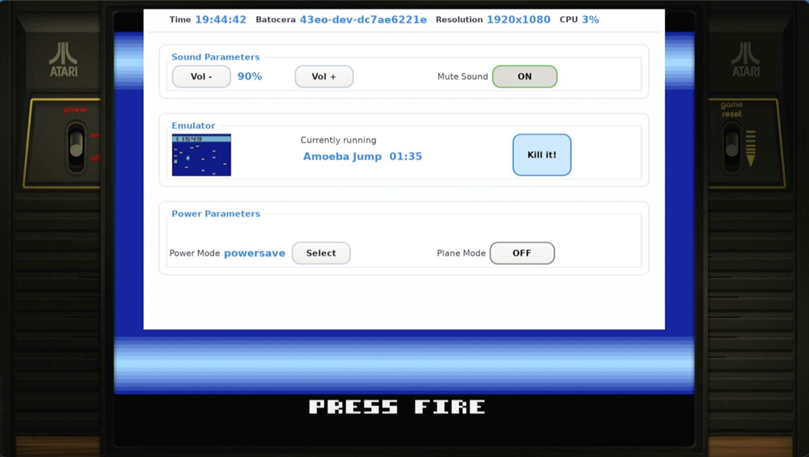

# Batocera Control Center

A flexible, XML-driven control panel for Batocera that provides an on-screen interface for system configuration and control. Works on both X11 and Wayland (Sway) with gamepad, touchscreen and keyboard support



## Features

- **Cross-platform**: Works on X11 and Wayland/Sway
- **Multiple input methods**: Keyboard, mouse, touchscreen, and gamepad (via evdev)
- **XML-driven UI**: Define your interface in a simple XML file
- **Live updates**: Display values update automatically from shell commands
- **Customizable styling**: GTK3 CSS for complete visual control
- **Auto-close**: Optional inactivity timeout
- **Modal dialogs**: Confirmation dialogs and choice popups
- **Flexible layout**: Horizontal and vertical groups with nested containers

## Quick Start

```bash
# Run with default configuration
./controlcenter.py

# Run with custom XML and CSS
./controlcenter.py /path/to/config.xml /path/to/style.css

# Run with 10-second inactivity timeout
./controlcenter.py controlcenter.xml style.css 10
```

## File Locations

When run without arguments, the application searches for configuration files in this priority order:

1. **User overrides**: `/userdata/system/configs/controlcenter/`
2. **System defaults**: `/usr/share/batocera/controlcenter/`
3. **Local directory**: Same directory as `controlcenter.py`

This allows users to customize their configuration without modifying system files.

## Command Line Parameters

```
./controlcenter.py [xml_path] [css_path] [auto_close_seconds]
```

- `xml_path`: Path to XML configuration file (default: auto-detected)
- `css_path`: Path to CSS stylesheet (default: auto-detected)
- `auto_close_seconds`: Inactivity timeout in seconds (default: 0 = never close)
  - Timer resets on any user interaction (navigation, button clicks)
  - Window also closes when losing focus (clicking outside)

## XML Configuration

### Basic Structure

```xml
<features>
  <hgroup display="Group Title">
    <vgroup>
      <feature display="Feature Name">
        <!-- Controls go here -->
      </feature>
    </vgroup>
  </hgroup>
</features>
```

### Container Elements

#### `<hgroup>` - Horizontal Group
Creates a titled section with a frame border.

```xml
<hgroup display="Sound Parameters">
  <!-- Content -->
</hgroup>
```

**Attributes:**
- `display`: Group title (optional, omit for no frame)

#### `<vgroup>` - Vertical Group
Creates a row of cells displayed horizontally. Can be used at root level or inside `<hgroup>`.

```xml
<vgroup>
  <feature display="Volume">
    <button display="Vol -" action="amixer set Master 5%-" />
    <text display="${amixer get Master | grep -o '[0-9]*%' | head -1}" />
    <button display="Vol +" action="amixer set Master 5%+" />
  </feature>
</vgroup>
```

**Special attribute:**
- `role="header"`: Makes the vgroup non-selectable and displays at the top (for status bars)

#### `<feature>` - Feature Row
A single row containing a label and controls.

```xml
<feature display="Power Mode">
  <text display="${cat /sys/devices/system/cpu/cpufreq/policy0/scaling_governor}" />
  <choice display="Performance" action="cpufreq-set -g performance" />
  <choice display="Powersave" action="cpufreq-set -g powersave" />
</feature>
```

**Attributes:**
- `display`: Label text
- `name`: Alternative to display (deprecated)

### Control Elements

#### `<button>` - Action Button
Executes a shell command when clicked.

```xml
<button display="Reboot" action="systemctl reboot" />
```

**Attributes:**
- `display`: Button label
- `action`: Shell command to execute
- `align`: Button alignment - `left`, `center` (default), or `right`

#### `<button_confirm>` - Confirmation Button
Shows a confirmation dialog before executing the action.

```xml
<button_confirm display="Kill Emulator" action="killall emulatorlauncher" />
```

**Attributes:**
- `display`: Button label (also used in confirmation message)
- `action`: Shell command to execute after confirmation

#### `<toggle>` - Toggle Switch
A switch that executes different commands for ON/OFF states.

```xml
<toggle 
  value="${batocera-audio getSystemMute}"
  action_on="batocera-audio setSystemVolume mute"
  action_off="batocera-audio setSystemVolume unmute" />
```

**Attributes:**
- `value`: Command to get current state (returns "true"/"false", "1"/"0", "on"/"off", etc.)
- `display`: Command to get display value (optional, shows as label if provided)
- `action_on`: Command to execute when turning ON
- `action_off`: Command to execute when turning OFF
- `refresh`: Update interval in seconds (default: 1)
- `align`: Toggle alignment - `left`, `center` (default), or `right`

#### `<text>` - Display Text
Shows static text or dynamic output from a command.

```xml
<!-- Static text -->
<text display="Hello World" />

<!-- Dynamic text from command -->
<text display="${date +'%H:%M:%S'}" refresh="1" />

<!-- Command expansion in text -->
<text display="Load avg: ${cat /proc/loadavg | cut -d' ' -f1}%" />
```

**Attributes:**
- `display`: Text to display or `${command}` for dynamic content
- `refresh`: Update interval in seconds (default: 1)
- `align`: Text alignment - `left`, `center` (default), or `right`

**Command formats:**
- `${command}`: Single command, output replaces entire text
- `Text ${cmd1} more ${cmd2}`: Multiple commands embedded in text

#### `<choice>` - Choice Option
Creates a "Select" button that opens a popup with multiple choices.

```xml
<feature display="Power Mode">
  <text display="${cat /sys/devices/system/cpu/cpufreq/policy0/scaling_governor}" />
  <choice display="Performance" action="cpufreq-set -g performance" />
  <choice display="Powersave" action="cpufreq-set -g powersave" />
  <choice display="Ondemand" action="cpufreq-set -g ondemand" />
</feature>
```

**Attributes:**
- `display`: Option label in the popup
- `action`: Shell command to execute when selected

#### `` - Image Display
Shows an image from a file, URL, or command output.

```xml
<!-- Static image file -->


<!-- Image from URL -->


<!-- Dynamic image path from command -->

```

**Attributes:**
- `display`: File path, URL, or `${command}` that returns a path
- `width`: Image width in pixels (optional)
- `height`: Image height in pixels (optional)
- `refresh`: Update interval for dynamic images (default: 1)
- `align`: Image alignment - `left`, `center` (default), or `right`

**Notes:**
- If only width or height is specified, aspect ratio is preserved
- Supports common formats: PNG, JPEG, GIF, etc.

### Layout Examples

#### Header Status Bar

```xml
<vgroup role="header">
  <feature name="Time">
    <text display="${date +'%H:%M:%S'}" />
  </feature>
  <feature display="CPU">
    <text display="${top -bn1 | grep 'Cpu(s)' | awk '{print $2}'}%" />
  </feature>
</vgroup>
```

#### Volume Control

```xml
<hgroup display="Sound Parameters">
  <vgroup>
    <feature>
      <button display="Vol -" action="batocera-audio setSystemVolume -5" />
      <text display="${batocera-audio getSystemVolume}%" />
      <button display="Vol +" action="batocera-audio setSystemVolume +5" />
    </feature>
    <feature display="Mute Sound">
      <toggle 
        value="${batocera-audio getSystemMute}"
        action_on="batocera-audio setSystemVolume mute"
        action_off="batocera-audio setSystemVolume unmute" />
    </feature>
  </vgroup>
</hgroup>
```

#### Power Management with Choices

```xml
<hgroup display="Power Parameters">
  <vgroup>
    <feature display="Power Mode">
      <text display="${cat /sys/devices/system/cpu/cpufreq/policy0/scaling_governor}" />
      <choice display="Performance" action="cpufreq-set -g performance" />
      <choice display="Powersave" action="cpufreq-set -g powersave" />
      <choice display="Ondemand" action="cpufreq-set -g ondemand" />
    </feature>
  </vgroup>
</hgroup>
```

## CSS Styling

The interface uses GTK3 CSS for styling. All elements have CSS classes for customization.

### Available CSS Classes

```css
/* Main window */
.popup-root { }

/* Groups */
.group-frame { }
.group-title { }

/* Rows */
.vgroup-row { }
.vgroup-cell { }
.vgroup-cell-first { }

/* Text and labels */
.item-text { }
.value { }
.header { }

/* Buttons */
.cc-button { }
.cc-toggle { }
.cc-choice { }
.cc-button-confirm { }

/* Selection states */
.focused { }
.focused-cell { }
.choice-selected { }

/* Dialogs */
.confirm-dialog { }
.choice-option { }

/* Separators */
.section-separator { }
```

### Example Stylesheet

```css
/* Main window background */
.popup-root {
  background-color: rgba(20, 20, 20, 0.95);
  color: #ffffff;
}

/* Group frames */
.group-frame {
  border: 2px solid #444444;
  border-radius: 8px;
  background-color: rgba(30, 30, 30, 0.8);
  margin: 8px;
  padding: 8px;
}

.group-title {
  color: #00d4ff;
  font-size: 16px;
  font-weight: bold;
}

/* Buttons */
.cc-button {
  background-color: #333333;
  color: #ffffff;
  border: 2px solid #555555;
  border-radius: 6px;
  padding: 8px 16px;
  min-width: 80px;
}

.cc-button:hover {
  background-color: #444444;
  border-color: #00d4ff;
}

/* Selected button */
.focused-cell,
.choice-selected {
  background-color: #00a8cc !important;
  border-color: #00d4ff !important;
}

/* Toggle switches */
.cc-toggle {
  background-color: #555555;
  border: 2px solid #777777;
  border-radius: 20px;
  padding: 6px 20px;
  min-width: 60px;
}

.cc-toggle:checked {
  background-color: #00cc66;
  border-color: #00ff88;
}

/* Text values */
.value {
  color: #00d4ff;
  font-size: 14px;
  font-weight: bold;
}
```

## Input Controls

### Keyboard

- **Arrow Keys**: Navigate between controls
  - Up/Down: Move between rows
  - Left/Right: Move between controls in a row or vgroup
- **Enter/Space**: Activate selected control
- **Escape**: Close window or dialog

### Gamepad

The application uses evdev for gamepad support with exclusive access (prevents EmulationStation from receiving inputs while the control center is open).

- **D-Pad/Left Stick**: Navigate
- **A Button (South)**: Activate/Confirm
- **B Button (East) / Start**: Close/Cancel

Supported controllers: Xbox, PlayStation, and most standard gamepads.

### Mouse/Touch

- Click any button or control to activate
- Click outside the window to close (if focus-out is enabled)

## Window Behavior

### Sizing
- Width: 64% of screen width
- Height: Automatically sized to content, up to 70% of screen height
- Content is scrollable if it exceeds the maximum height

### Positioning
- **X11**: Centered horizontally, 20px from top
- **Wayland/Sway**: Centered by compositor

### Auto-Close
The window closes automatically in these situations:
1. **Inactivity timeout**: If configured (3rd command line parameter)
   - Timer resets on any user interaction
   - Does not close while dialogs are open
2. **Focus loss**: When clicking outside the window
   - Does not close when opening dialogs (choice/confirm)

### Wayland/Sway Specific
On Wayland/Sway, the window uses a special technique to ensure visibility:
- Briefly enters fullscreen mode on startup
- Returns to floating mode and centers
- This works around Sway's visibility handling for floating windows

## Development

### File Structure

```
batocera-controlcenter/
├── controlcenter.py     # Main entry point
├── ui_core.py           # UI rendering and window management
├── xml_utils.py         # XML parsing and validation
├── shell.py             # Shell command execution utilities
├── refresh.py           # Background refresh tasks
├── controlcenter.xml    # Default UI configuration
├── style.css            # Default stylesheet
└── README.md            # This file
```

### Adding New Control Types

1. Add XML validation in `xml_utils.py`
2. Add rendering logic in `ui_core.py` (in `_build_vgroup_row` or `_build_feature_row`)
3. Add CSS classes in `style.css`
4. Update this README with documentation

### Testing

```bash
# Test with custom config
./controlcenter.py test.xml test.css

# Test with auto-close
./controlcenter.py test.xml test.css 5

# Test on X11
DISPLAY=:0 ./controlcenter.py

# Test on Wayland
WAYLAND_DISPLAY=wayland-0 ./controlcenter.py
```

### Debugging

Enable debug output by checking the console. The application prints:
- Backend detection (X11/Wayland)
- Window sizing information
- CSS loading status
- Gamepad detection

## Requirements

- Python 3.7+
- GTK 3.0
- GLib
- python-evdev (for gamepad support)
- Wayland/Sway or X11

## License

This program is free software: you can redistribute it and/or modify it under the terms of the GNU General Public License as published by the Free Software Foundation, version 3.

Copyright (c) 2025 lbrpdx for the Batocera team

## Contributing

Contributions are welcome! Please ensure:
- XML validation passes for new elements
- CSS classes are documented
- Code follows existing style
- README is updated for new features

## Troubleshooting

### Window doesn't appear on Wayland
- Ensure Sway is running: `echo $WAYLAND_DISPLAY`
- Check Sway logs: `journalctl -u sway`
- Try with decorations: The window uses decorated mode on Wayland by default

### Gamepad not working
- Check evdev is installed: `python3 -c "import evdev"`
- Verify gamepad is detected: `ls /dev/input/event*`
- Check permissions: User must have access to `/dev/input/event*`

### Commands not executing
- Test commands in terminal first
- Check command output: Commands should return clean text
- Escape special characters in XML: Use `&amp;` for `&`, `&lt;` for `<`, etc.

### CSS not loading
- Verify CSS file exists and is readable
- Check console for CSS parsing errors
- Ensure GTK 3.0 compatible syntax (no GTK 4 features)

### Window closes unexpectedly
- Check if auto-close timeout is set
- Verify focus-out behavior (clicking outside closes window)
- Ensure dialogs are not triggering premature closure
